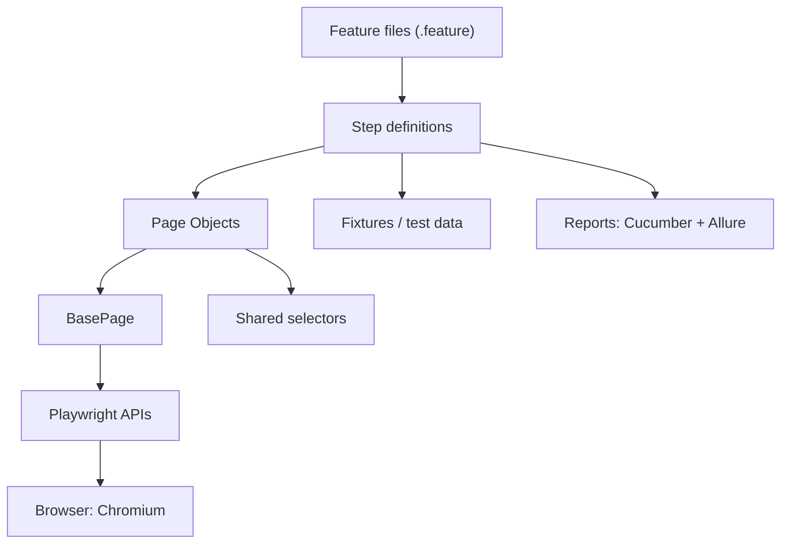

# Cart Sentinel Carrefour TN

Mini projet de test automation e-commerce sur [Carrefour Tunisie](https://www.carrefour.tn/), construit pour démontrer une approche QA Automation propre, maintenable et orientée risque.

Le nom **Cart Sentinel** reflète l'objectif du framework : surveiller les parcours qui impactent directement l'expérience client et la conversion.

## Why Carrefour TN?

I chose Carrefour Tunisia because it is a real public e-commerce website with real constraints: dynamic product lists, cookie consent, account redirection, cart availability and changing content. A demo site would be easier, but it would not show how a QA engineer deals with functional ambiguity and live-site instability.

This project is intentionally focused on public customer flows. No payment test is executed and no private user data is used.

## Why This Project Stands Out

- Stack moderne : Playwright, Cucumber, TypeScript, Page Object Model.
- Clean Architecture lisible par QA, PO et développeurs.
- Scénarios e-commerce réalistes : home, recherche, fiche produit, panier, navigation, compte, wishlist, newsletter, footer.
- Couverture responsive desktop + mobile via Playwright device emulation.
- Docker pour exécuter le framework dans un environnement reproductible.
- Approche business-first : comprendre le parcours client Carrefour avant d'automatiser.
- Tags orientés risque : `@smoke`, `@risk`, `@negative`, `@conversion`, `@header`, `@account`, `@footer`.
- Lecture fonctionnelle senior : risques business, contraintes site réel, comportements anonymes et signaux de conversion.
- Screenshots, vidéos, trace et Allure report pour analyser les échecs.
- GitHub Actions CI pour smoke tests, lint, typecheck et artefacts de rapport.
- Configuration via `.env` pour exécution locale, CI ou debug headed.

## Architecture

```txt
Feature files
   ↓
Step definitions
   ↓
Page Objects
   ↓
Base Page / Shared selectors / Fixtures
   ↓
Playwright APIs
```



```txt
cart-sentinel-carrefour-tn/
├── features/
├── reports/
├── screenshots/
├── scripts/
├── src/
│   ├── config/
│   ├── core/
│   ├── fixtures/
│   ├── pages/
│   ├── selectors/
│   ├── steps/
│   └── support/
├── videos/
├── cucumber.js
├── Dockerfile
├── docker-compose.yml
├── playwright.config.ts
├── package.json
└── README.md
```

## Covered Flows

| Area | Scenarios | QA angle |
| --- | --- | --- |
| Home page | Page displayed, search bar visible | Availability and entry point readiness |
| Search | Existing product, no-result product | Conversion and negative UX |
| Product details | Open first result, validate name and price | Decision information integrity |
| Cart | Add, update quantity, remove | Revenue path integrity |
| Navigation | Header, category menu, store locator, help center | Discoverability and support access |
| Customer | Sign in, wishlist, newsletter validation | Account entry and CRM quality |
| Content | Footer service links, social links | Trust, support and brand presence |

## Functional QA Layer

This repository includes a human QA layer, not only automation code:

- [QA Decisions](QA_DECISIONS.md): why Carrefour, what was automated, limits and trade-offs.
- [QA Strategy](docs/qa-strategy.md): risk model, scope, constraints and release confidence.
- [Wassim Test Strategy](docs/wassim-test-strategy.md): risk-based strategy inspired by reconnaissance, critical-flow focus and feature encirclement.
- [Exploratory Test Charter](docs/test-charter.md): personas, heuristics and product questions.
- [Wassim Test Plan](docs/test-plan-wassim.md): business-first test plan from functional review to automation.
- [Manual Test Cases](docs/manual-test-cases.md): functional test cases reviewed before automation.
- [Bug Reports](docs/bug-reports.md): real anomalies observed while testing the live website.
- [Negative Scenarios](docs/negative-scenarios.md): automated vs planned negative coverage.

The goal is to show that the framework is driven by business risk and user behavior, not by selector collection.

## Wassim Test Plan

This project follows a business-first test plan:

1. understand how Carrefour TN customers search, decide and start a cart intent;
2. identify where the journey can break or become unclear;
3. document functional risks and observed anomalies;
4. automate only the checks that protect meaningful customer and business value.

The out-of-the-box idea is simple: the framework is not built to prove that buttons can be clicked. It is built to show how an e-commerce product can be reviewed functionally, how risky flows can be challenged, and how that understanding can become reliable automation.

That is the quality approach behind the project.

## Setup

```bash
npm install
npx playwright install
```

Copy `.env.example` to `.env` if needed, then adjust:

```env
BASE_URL=https://www.carrefour.tn
BROWSER=chromium
DEVICE=desktop
HEADLESS=true
DEFAULT_TIMEOUT_MS=15000
```

## Commands

```bash
npm run test
npm run test:headed
npm run test:smoke
npm run test:mobile
npm run test:mobile:headed
npm run test:risk
npm run test:navigation
npm run test:customer
npm run test:content
npm run test:cart
npm run test:search
npm run test:product
npm run report
npm run allure:generate
npm run allure:open
npm run docker:build
npm run docker:smoke
npm run docker:mobile
npm run docker:compose:smoke
npm run docker:compose:mobile
npm run lint
npm run typecheck
```

## Docker

Docker is included to make the framework reproducible outside the local machine. The image uses the official Playwright base image, installs Java for Allure, installs project dependencies with `npm ci`, and runs tests in headless Chromium.

Build the image:

```bash
npm run docker:build
```

Docker Desktop or the Docker daemon must be running before executing these commands.

Run desktop smoke tests:

```bash
npm run docker:smoke
```

Run mobile smoke tests:

```bash
npm run docker:mobile
```

Run with Docker Compose and keep reports on the host machine:

```bash
npm run docker:compose:smoke
npm run docker:compose:mobile
```

This is useful for interviews and CI discussions because it proves the automation does not depend on one developer laptop setup.

## Reporting

After execution, Cucumber generates:

- `reports/cucumber-report.html`
- `reports/cucumber-report.json`
- `allure-results/`
- `reports/allure-report`
- screenshots attached to failed scenarios and visible in Allure as failure evidence
- videos in `videos/` when configured
- Playwright trace archives in `traces/` when `TRACE=on` or a scenario fails with `TRACE=retain-on-failure`

A portfolio-friendly static sample is included at:

```txt
reports/sample-report.html
```

## CI

GitHub Actions is configured in:

```txt
.github/workflows/qa-automation.yml
```

The CI pipeline runs:

- dependency installation with `npm ci`;
- Playwright Chromium installation;
- lint;
- TypeScript typecheck;
- desktop smoke tests;
- mobile smoke tests using Playwright `Pixel 5` emulation;
- Allure report generation;
- report artifact upload.

The Dockerfile can also be used as a portable execution layer for another CI provider when GitHub Actions is not available.

## Mobile Coverage

Mobile coverage is controlled through the `DEVICE` environment variable:

```bash
DEVICE=desktop npm run test:smoke
DEVICE=mobile npm run test:smoke
```

The mobile profile uses Playwright device emulation with a real mobile viewport, mobile user agent and touch capabilities. The objective is not to duplicate all scenarios, but to protect the highest-risk customer journeys on a smaller screen: home, search, product details, cart intent and core navigation.

## Data-Driven And Negative Testing

The framework uses Cucumber scenario data and centralized fixtures for reusable technical preconditions.

Covered negative or resilience checks:

- non-existing product search;
- empty newsletter submission;
- anonymous wishlist redirection;
- cart empty/safe state;
- planned/manual: price filter boundaries and out-of-stock product behavior.

## Flaky Handling

The live website has dynamic UI behavior, so the framework includes:

- centralized wait strategy in `BasePage`;
- first visible locator selection to avoid hidden DOM elements;
- cookie consent handling;
- desktop/mobile browser context handled centrally;
- retry controlled by `.env`;
- video and trace retained on failure;
- screenshots attached on failure.

## Limitations

- No payment test executed.
- No checkout completion.
- Only public flows are tested.
- No private account data is used.
- Some cart behavior depends on session, delivery or live availability.

## Senior QA Notes

This project is intentionally small, but the design decisions are professional:

- Gherkin remains business-readable.
- Steps orchestrate behavior only.
- Page Objects own selectors and UI interactions.
- Mobile and desktop share the same business-readable scenarios.
- Shared selectors live outside Page Objects when reused across modules.
- Test data used by technical preconditions is centralized in `fixtures`.
- `BasePage` centralizes common Playwright actions.
- `.env` keeps runtime behavior configurable.
- Tags enable risk-based execution.
- Failure evidence is collected automatically.
- Live-site constraints are isolated in Page Objects so the feature language stays clean.
- Anonymous customer behavior is treated as a valid functional path, especially for account and wishlist.
- Negative scenarios validate quality of recovery, not only happy-path coverage.

## LinkedIn Post

Mini projet personnel : **Cart Sentinel Carrefour TN**

J'ai construit un mini-framework de test automation e-commerce autour de Carrefour Tunisie avec Playwright, Cucumber, TypeScript et Page Object Model.

Objectif : montrer une architecture propre, maintenable et proche d'un contexte professionnel, avec un plan de test orienté risque.

Parcours couverts :

- affichage de la home page
- recherche produit
- gestion du no-result
- fiche produit
- ajout, modification et suppression panier
- navigation header/menu
- compte, wishlist et newsletter
- footer/support/social links

Le projet inclut reporting HTML, screenshots en cas d'échec, exécution headless/headed et tags de risque pour piloter les tests critiques.

## CV Version

**Cart Sentinel Carrefour TN - E-commerce Test Automation Framework**

Conception d'un mini-framework QA Automation avec Playwright, TypeScript, Cucumber, Page Object Model et Clean Architecture. Automatisation de parcours e-commerce critiques : home page, recherche produit, fiche produit, panier, navigation, compte, wishlist, newsletter, footer et support. Mise en place du reporting HTML, screenshots en cas d'échec, configuration multi-environnement via `.env` et exécution orientée risque avec tags Cucumber.

## Author

Wassim Askri - QA Automation Engineer
